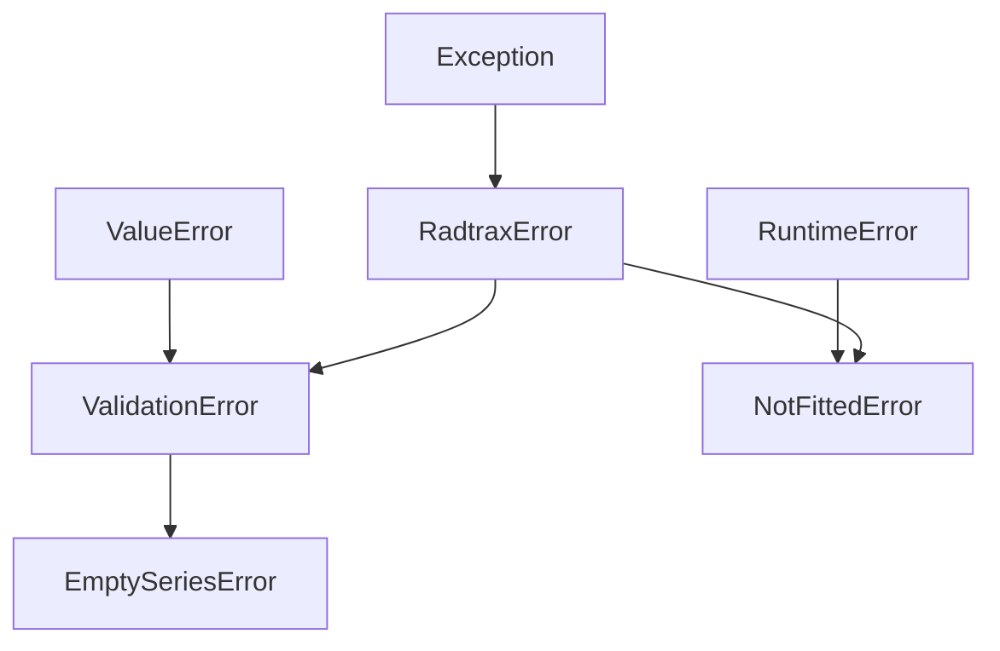

# Exceptions

Every error raised by the package derives from
[`RadtraxError`][radtrax.RadtraxError] *and* from the closest
standard-library exception.

```mermaid
graph TD
    E[Exception] --> M[RadtraxError]
    V[ValueError] --> VE[ValidationError]
    M --> VE
    VE --> ES[EmptySeriesError]
    R[RuntimeError] --> NF[NotFittedError]
    M --> NF
```

::: radtrax.exceptions
